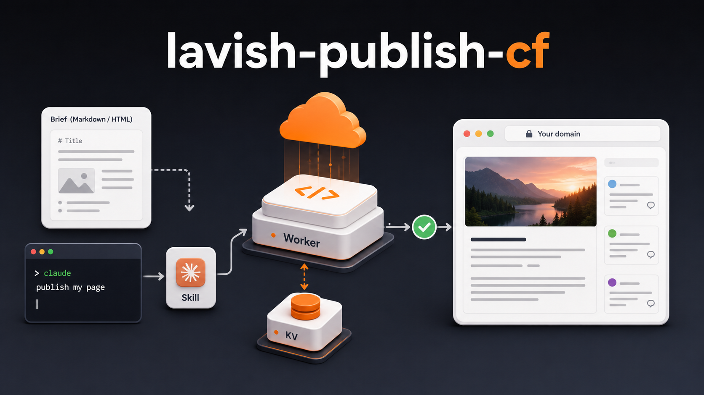

# lavish-publish-cf

Self-host a Cloudflare Worker that publishes themed HTML pages on your own domain — plus the Claude Code skill that drives it.



API-compatible with [htmlship.com](https://htmlship.com) (same shape, same CLI verbs), but runs on **your** Cloudflare account with **your** KV. No third party in the loop, no monthly fee, no vendor lock-in.

```
lavish-publish-cf/
├── worker/   ← Cloudflare Worker (src/index.ts) + Node CLI (cli/index.js)
└── skill/    ← /publish Claude Code skill
```

## What you get

- A **Worker** (`worker/`) that accepts `POST /api/v1/pages` and serves the resulting page at `/v/<slug>` under a strict CSP (`script-src 'none'`).
- A zero-dep **CLI** (`worker/cli/index.js`, installs as `publish-cf`) that handles publish, update, delete, list-mine, plus per-page inline comments.
- An inline **comment** UI on `/v/<slug>` — viewers select text and leave anchored comments; the owner addresses them and runs `publish-cf comments resolve <slug> <id>`.
- A **Claude Code skill** (`skill/`) that goes from "a markdown brief" / "a description" / "an existing HTML file" to a themed, published page in one command. Picks a theme from [`lavish-themes`](https://github.com/natekettles/lavish-themes), inlines the styling, calls the CLI, reports the URL.

## Install

```sh
git clone https://github.com/natekettles/lavish-publish-cf.git
cd lavish-publish-cf
./scripts/install.sh
```

The installer walks through:

1. `cd worker && npm install` (Wrangler + nothing else)
2. `npx wrangler login` (interactive — opens browser)
3. `npx wrangler kv namespace create PAGES` and patches `wrangler.toml`
4. `npx wrangler deploy` — your worker goes live on `*.workers.dev`
5. `npm install -g .` so `publish-cf` is on your PATH
6. Optional: symlink `skill/` into `~/.claude/skills/publish` so Claude Code can find it

Steps that need your input pause and ask. Steps that don't, run. Re-running is safe — every step detects "already done" and skips.

After install, see [`worker/README.md`](worker/README.md) for the full Worker + CLI reference.

## How the pieces talk to each other

```
You ──/publish brief.md──▶ Claude Code
                              │
                              │  reads ~/.lavish-themes/tier{1,2}/<slug>.html
                              │  (from lavish-themes)
                              ▼
                          themed HTML
                              │
                              │  publish-cf publish report.html …
                              ▼
                          your Worker (workers.dev or custom domain)
                              │
                              │  KV: PAGES namespace
                              ▼
                          https://<your-worker>/v/<slug>
```

The skill assumes `~/.lavish-themes` exists (the install location used by [`lavish-themes`](https://github.com/natekettles/lavish-themes)). If you skip themes installation, the skill will still work for HTML you supply pre-styled — it just can't pick a theme for you.

## Related projects

- [`lavish-axi`](https://github.com/kunchenguid/lavish-axi) — local editor and review surface. `/publish loc <source>` (handled by the same skill in `skill/`) saves to `.lavish/` and opens with `lavish-axi` instead of publishing.
- [`lavish-themes`](https://github.com/natekettles/lavish-themes) — the six theme shells the skill picks from.

## Licence

MIT — see [`LICENSE`](LICENSE).
